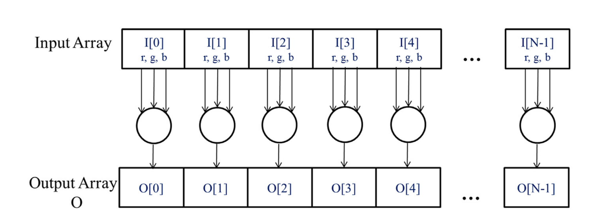

# Introduction
CPU design is latency oriented . GPU design is throughput oriented . The speed of many graphic applications is limited by the rate at which data can be delivered from the memory system into processors and vice versa . A GPU
must be capable of moving extremly large amounts of data into and out of graphics frame buffers in DRAM . The prevailing solution in GPUs is to optimize for t he execution . The design style is commonly referred to as throughput oriented design , as it strives to maximize the total execution throughput of a large of threads while allowing individual threads to take a potentially much longer time to execute .

# Heterogenous Data Parallel Computing

The structure of a CUDA C program reflects the coexistence of a host(CPU) and one or more devices (GPUs) in the computer . C -> Host , CUDA C -> Host , Device .
The execution starts with host code(CPU serial code) . When a kernel function is called a large number of threads are launched on a device to execute the kernel . All the threads that are launched by a kernel call are collectively called a grid. These threads are the primary vehicle of parallel execution in cuda platform when all threads of a grid have completed their execution , the grid terminates and the execution continues , on the host until another grid is launched  . In current cuda system , devices are often hardware cards that come with their own dynamic random   access memory called device global memory .

For Kernel -->
1. Allocate Space in global memory .
2. Host to global memory .
